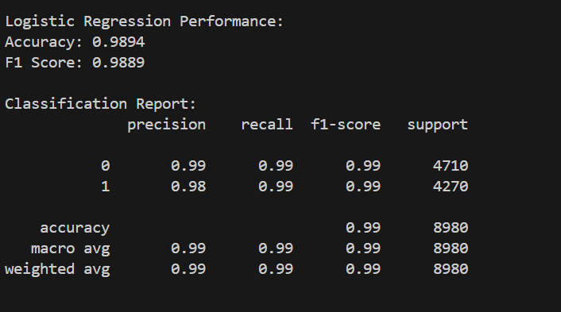
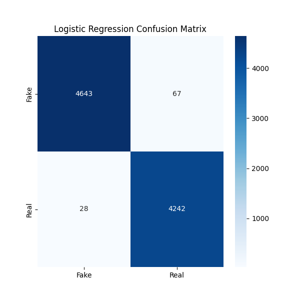
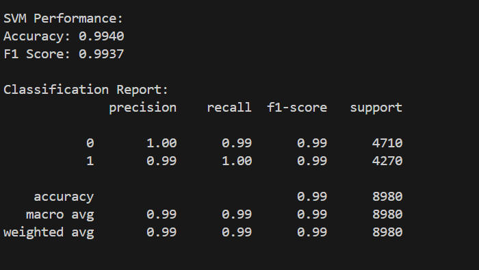
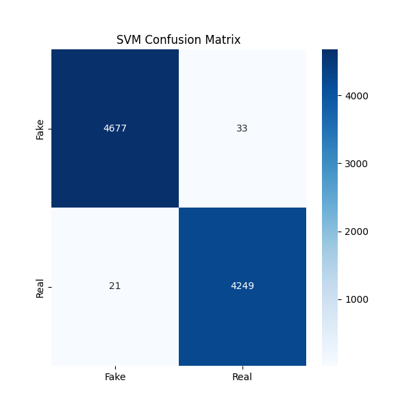
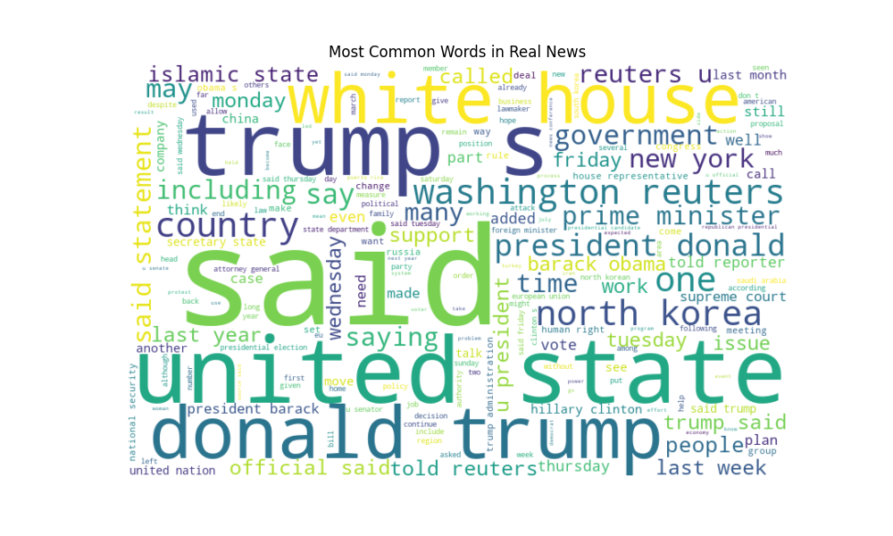

# 📰 Fake-News-Detection-NLP

This project detects whether news articles are **fake or real** using **Natural Language Processing (NLP)** and **Machine Learning** techniques.  
It includes text preprocessing, feature extraction with TF-IDF, training **Logistic Regression** and **SVM** classifiers, and visualizing frequent words with **WordClouds**.

---

## ✨ Features
- 🧹 Text preprocessing: cleaning, tokenization, stopword removal, and lemmatization
- 📊 Feature extraction: TF-IDF vectorization
- 🤖 Classification models: Logistic Regression and SVM
- 📈 Evaluation using accuracy, F1-score, and classification reports
- 🎨 WordCloud visualization of most frequent words in fake vs real news
- 💾 Save and load trained models for predictions

---

## 📂 Dataset
The project uses the **Fake and Real News Dataset** from Kaggle.  
It contains separate CSV files for fake and real news:

| File Name   | Content        | Number of Articles |
|------------|----------------|------------------|
| `Fake.csv` | Fake news      | ~23,502          |
| `True.csv` | Real news      | ~21,417          |

📥 Download here: [Fake and Real News Dataset](https://www.kaggle.com/datasets/clmentbisaillon/fake-and-real-news-dataset)

---

## 🛠 Requirements
- Python 3.x  
- pandas  
- nltk  
- scikit-learn  
- matplotlib  
- wordcloud  
- joblib  

---

## ⚡ Installation

1. Clone the repository or download the script:

```bash
git clone https://github.com/your-username/Fake-News-Detection-NLP.git
cd Fake-News-Detection-NLP
```

2. Install the required Python packages:
```bash
pip install pandas nltk scikit-learn matplotlib wordcloud joblib
```

3. Download necessary NLTK datasets (the script includes this, but you can also run separately):
```python
import nltk
nltk.download('stopwords')
nltk.download('wordnet')
nltk.download('omw-1.4')
```
---

## 🚀 Usage

### 1️⃣ Train the Models
1. Open the **training script** (`Task3_Fake_News_Detection_Code_and_ModelSaving.py`) in your editor.  
2. Update the dataset file paths:

```python
fake_path = "path/to/Fake.csv"
true_path = "path/to/True.csv"
```

3. **Run the script**.  

This will:
- Preprocess the dataset
- Train Logistic Regression and SVM models
- Save the models and TF-IDF vectorizer as:
  - `logistic_model.pkl`
  - `svm_model.pkl`
  - `tfidf_vectorizer.pkl`

### 2️⃣ Use the Trained Models
1. Open the **model usage script** (`Task3_Model_Usage`) in your editor.  
2. Update the paths to your saved models if needed

---

## ⚠️ Notes
- Make sure the file paths to your datasets match your project folder.  
- You can tweak vectorizer parameters or classifiers for experimentation.

---

## 📊 Results

### Model Accuracy and F1-Scores
| Model                | Accuracy | F1-score |
|----------------------|----------|----------|
| Logistic Regression  | 0.98     | 0.98     |
| SVM                  | 0.99     | 0.99     |

### Visualizations

#### Logistic Regression Accuracy


#### Logistic Regression Confusion Matrix


#### SVM Accuracy


#### SVM Confusion Matrix


#### Most Common Words in Fake News


#### Most Common Words in Real News


---

## 📜 License
This project is open source and available under the MIT License.


